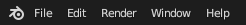

# User Manual

## Plugin Introduction

This plugin is developed by CubeVi. The current latest version is 2.0.0. It supports previewing and saving rendered images/videos. It supports Blender versions 3.4-4.3. Note: Due to API issues in Blender 4.3, there might be some offset when previewing objects in this version. The rendering function works normally.

## Plugin Installation

**Prerequisites:**

Windows OS

Blender **3.4 and above**

Download the plugin compatible with Blender 3.4-4.0 or 4.1-4.3 depending on your version.

CubeVi-Swizzle-Blender_3.4-4.0.zip (No need to unzip)

CubeVi-Swizzle-Blender_4.1-4.3.zip (No need to unzip)

**Plugin Installation:**

Open Blender, click Edit in the upper left corner, and select Preferences in the pop-up menu.

If an older version of the blender_preview plugin is installed, you need to uninstall the old version first.

**For Blender 4.1 and below:**

In the opened window, select Install.

In the pop-up interface, select the plugin installation package (zip file, no need to unzip), and click Install Add-on in the lower right corner.

A message in the lower right corner will indicate that the plugin has been installed successfully. "3D View: CubeVi-Swizzle-Blender" will appear in the interface.

Check the box on the left to enable the plugin.

Click the small arrow on the right side of the Blender toolbar to open the extension bar. The LFD extension will be displayed, indicating successful plugin installation.

 

**For Blender 4.1 and above:**

Select Install from Disk from the small arrow in the upper right corner of Preferences. Subsequent operations are the same. In Blender 4.2 and above, the plugin will be enabled automatically after installation.

## Plugin Usage

**Device Connection:**

Connect the display, open Cubestage and update to the latest version 2.0.1 or above (needs to remain open), and ensure the device is recognized. 

Open Blender and switch to the LFD plugin interface.

Click Connect. A "Connection Successful" message will appear below, and the camera resolution will automatically switch to the default 540*960.

**Camera Frustum Settings:**

Click on the Far, Near Clipping Plane, and Focal Plane fields to set the values for the far, near clipping planes, and focal plane.

Click Show Frustum to show the camera's viewing frustum and the focal plane position.

The far and near clipping planes determine the camera's rendering range. The camera will only render within the space enclosed by the far and near clipping planes.

The focal plane determines the camera's shooting focal plane position. The image captured by the camera is clearest at the focal plane. Before and after the focal plane, the image captured by the camera will gradually become blurred.

In the space on the side of the focal plane closer to the camera, the rendered image will have an in-screen effect.

In the space on the side of the focal plane further from the camera, the rendered image will have an out-of-screen effect.

Objects at the focal plane will have the clearest display effect.

Note: Objects far from the focal plane will have a poorer display effect at the focal plane, and may even lose their 3D effect.

**File Path Settings:**

Click the folder icon to jump to the path selection interface. Select the **folder** where you want to save subsequent images and videos.

**Real-time Rendering Preview:**

After the device is successfully connected, click Real-time Light Field Preview. The plugin will automatically recognize C1 and display the light field image.

After the real-time rendering screen is opened, the plugin bar will be locked, and the window will display the real-time rendering results of the active camera in the current 3D viewport.

Due to the performance overhead caused by rendering, operating the Blender panel may experience some lag at this time.

Press the **ESC** key to automatically exit real-time rendering.

**Save Preview Image:**

Set the save path in File Path Settings.

Click Save Quilt Preview Image to save the png format image under the current camera. (Currently only png is supported)

**Save and Upload Rendered Image:**

Set the save path in File Path Settings.

Click Save Multiview Render Pictures to save 40 individual viewpoint rendered images.

Click Synthesize Quilt Image to combine the 40 individual viewpoint rendered images into one quilt image.

Ensure the platform is open. Click Upload Quilt Picture to 3D Gallery to upload the grid image generated in the previous step to the 3D Gallery (maximum grid image size is 70MB). You can view it from 3D Gallery -> Avatar -> My Creations.

**Animation Rendering and Upload:**

Set the save path in File Path Settings.

Set the start frame and end frame for the animation you want to render. It is recommended to switch the rendering engine to EEVEE (Cycles rendering is very slow). Click Render Animation. The plugin will automatically render each frame's grid image within the selected frame range and save it to the file path.

Set the start frame and end frame for the video you want to composite. Set the video frame rate. Click Composite Grid Image Sequence into Video. The plugin will automatically composite the grid image sequence within the selected frame range into output.mp4 according to the set video frame rate and save it to the file path.

Click Upload Video to Platform to upload output.mp4 to the 3D Gallery. Note: The maximum video upload size is 70MB.

## FAQ

Q: How do I exit real-time preview?

A: Press the Esc key in the Blender interface.

Q: Clicking Device Connection shows "Connection Failed".

A: Ensure Cubestage is open and the device is recognized.

Q: There are some black lines in the view.

A: Ensure the camera resolution is set correctly. Since the camera preview will render some auxiliary observation lines of objects in the scene, you can hide them by clicking  in the upper right corner to make them invisible.

Q: The option boxes are grayed out and no functions can be clicked.

A: Real-time rendering is currently in progress, or no active camera has been created in the viewport.

Q: The camera renders completely black.

A: Ensure the camera is created directly under the main collection of the scene, not in some sub-collections.

Q: Blender becomes very laggy after opening real-time rendering.

A: Due to the limitations of Blender's own rendering engine, real-time preview in Blender will consume a lot of computing resources. At the same time, for rendered objects with textures, the frame rate will be lower.

Q: Can I share the light field image I saved with others?

A: Due to certain parameter differences between different light field displays, the same light field image may have display differences on different monitors, leading to visual errors. You can share resources by sharing grid images.
